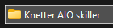
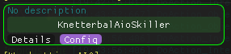
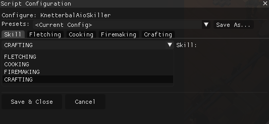
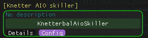
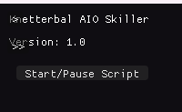

# Knetterbal AIO Skiller

## Features

* **Fletching**
	* Subskills:
		* FLETCH: Cut logs into unstrung bows
		* STRING: String unstrung bows
		* HEADLESS: Make headless arrows
		* ARROWS: Make arrows from arrow shafts and arrowheads
* **Cooking**
* **Firemaking**
* **Crafting**
	* Subskills:
		* CUT: Cut uncut gems
		* GLASS: Make glass items from sandstone
		* FLASKS: Make flasks from glass
		* ARMOR: Craft armor from leather
* **Divination porters**

* **Herblore: Potions**
	* Subskills:
		* POTIONS: Makes the potions u want. checks for supplies
		* COMBINATION POTIONS: Makes the overloads you want.
		* UNFINISHED POTIONS: Makes all the unfinished potions you need.
* **Other**	
	* Ghostly ink: Mixes ghostly ink for you.

### Notes for Herblore/Combination pots
- If you want to make those or  add more, you have to add the crystal flask id / have 1 in the preset.

## Configuration UI Explained

Before starting the script, you can click the config button.
Here you will select stuff that you wanna do 

### Skill Tab
- **Skill:** Choose the main skill you want to train: `FLETCHING`, `COOKING`, `FIREMAKING`, or `CRAFTING`.

- `FLETCHING` AND `COOKING` ARE DONE AT FORT.
- `FIREMAKING` IS AT BONFIRE PRIFF.
- `CRAFTING` GLASS IS DONE AT PRIFF
- MAKING `FLASKS/ CUT GEMS/ CRAFT ARMOR` AT FORT BANK (WORKSHOP)
- `DIVINATION` makes `PORTERS` AT FORT BANK (WORKSHOP)
- `HERBLORE` makes `POTIONS` AT FORT BOTANIST'S WORKBENCH
- `OTHER` makes `GHOSTLY INK` AT FORT BANK (WORKSHOP).

### Notes for Crafting/Fletching
- If you want to craft something with multiple options (for example dragonhide bodies,Arrow shafts or a certain bow ), you MUST craft 1 first so the script will keep crafting that item

### Fletching Tab
- **Sub Skill:** Select from `FLETCH`, `STRING`, `HEADLESS`, or `ARROWS`.
- **Log Type:** Select the type of log to use.
- **Arrowhead Type:** Select the type of arrowhead to use.
- **unf shortbows:** Select the type of unstrung shortbows.
- **unf longbows:** Select the type of unstrung longbows.

### Cooking Tab
- **Fish Type:** Select the type of fish you want to cook .

### Firemaking Tab
- **Log Type:** Select the type of log you want to burn.

### Crafting Tab
- **Sub Skill:** Select from `CUT`, `GLASS`, `FLASKS`, or `ARMOR`.
- **Sandstone:** Select the type of sandstone for glassmaking.
- **Glass:** Select the type of glass for flask making.
- **Uncut gem:** Select the type of gem to cut.
- **Leather:** Select the type of leather for armor crafting.

### Divination Porter Tab
- **Energy Type:** Select the type of Energy you want to use.
- **Necklace Type:** Select the type of necklace you need.
- **Porter Type:** Select the type of porter you want to make.

### Divination Porter Tab
- **Porter Type:** Select the type of porter you want to create.

### Herblore Tab
- **Sub skill:** Select from  `POTIONS`, `COMBINATION`, or `UNF`.
- **Potion Type:** Select the type potion you want to make.
- **Combination pots:** Select the type of combination potion you want.
- **unfinished pots:** Select the type of herb you want to use.

### Others Tab
- **Ghostly ink Type:** Select the type of ghostly ink you want to create.

### Notes
- For Fletching and Crafting, you **must** select a sub skill for the script to work correctly.
- If you select `NONE` for any dropdown, that option will be ignored by the script.

---

## How to Use

1. Place all files in the folder "Knetter AIO skiller".

2. Click `Config`

3. Choose desired settings
4. Click `Save & Close` and start the script.

5.Start the script in the script manager

6.click start/pause in top left corner (script GUI)

---

## Extending
To add more skills or materials, simply update the `config.lua` and `data.lua` files. The resolver is designed to automatically pick up new options if you follow the same naming conventions.

---

## Future updates
- Herblore in fort.

