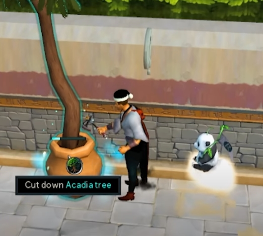
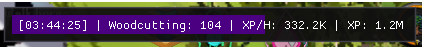

  
  <h3 align="center">Crystalliser</h3>

  <!--  -->
  <!--   -->
  <!--  -->

 
  

<!-- TABLE OF CONTENTS -->

  
Table of Contents

  <ol>
    <li>
      <a href="#quick-start">Quick start</a>
      <ul>
        <li><a href="#prerequisites">Prerequisites</a></li>
        <li><a href="#supported-buffs">Supported Buffs</a></li>
      </ul>
    </li>
    <li><a href="#roadmap">Roadmap</a></li>
  </ol>

## ⚡️ Quick start

Download [Crystalliser](Crystalliser.lua) and place into the Lua_Scripts folder 
Replace TREE variable with ID of tree you wish to cut 
Start the script

## ⚙️ Prerequisites

Script is written around the [Woodcutting Training to 200M XP Guide](https://dereferer.me/?https://runescape.wiki/w/Pay-to-play_Woodcutting_training#Training_to_200m_XP)

:warning: **EXP RATES WILL DEPEND ON YOUR SETUP** :warning:

<!--  -->

## 📖 Supported Buffs

The following buffs will be monitor and reapplied

- Light Form
- Ancient Elven Ritual Shard
- Perfect Plus/Perfect Juju Woodcutting
  - Drinks Potions/Flasks
- Torstol Incense
- Beaver Familiar
  - Renew with Pouch
  - Drinks Potions/Flasks

## 📝 Roadmap

- [ ] Support Lumberjack Aura

(<a href="#readme-top">back to top</a>)
