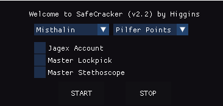
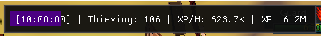
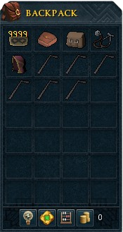
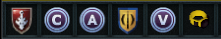

  
  <h3 align="center">SafeCracker</h3>

  
   
  

  

<!-- TABLE OF CONTENTS -->

  
Table of Contents

  <ol>
    <li>
      <a href="#quick-start">Quick start</a>
      <ul>
        <li><a href="#prerequisites">Prerequisites</a></li>
        <li><a href="#supported-optionals">Supported Optionals</a></li>
      </ul>
    </li>
    <li><a href="#routes">Routes</a></li>
    <li><a href="#roadmap">Roadmap</a></li>
  </ol>

## ⚡️ Quick start

Download [SafeCracker](SafeCracker.lua) and place into the Lua_Scripts folder
Start the script and complete GUI setup

## ⚙️ Prerequisites

- Levels
  - Thieving 65+

- Items
    - <a href="https://dereferer.me/?https://runescape.wiki/w/Lockpick">Lockpick</a> or <a href="https://dereferer.me/?https://runescape.wiki/w/Master_thief%27s_Lockpick">Master thief's lockpick</a>
    - <a href="https://dereferer.me/?https://runescape.wiki/w/Stethoscope">Stethoscope</a> or <a href="https://dereferer.me/?https://runescape.wiki/w/Master_thief%27s_stethoscope">Master thief's stethoscope</a>
    - Loot Bag
    - Wicked Hood
    - Plenty of runes for the teleport spells

- Teleportation
  - Lodestones
    - Varrock
    - Edgeville
    - Draynor
    - Lumbridge
    - Ardougne
    - Yanille
  - Teleports
    - Camelot

## 📖 Supported Optionals

Lodestone teleporation will be a fallback if you do not have these optional items/unlocks 
Items need to be on the action bar, including the Master camouflage head etc

- Thieves' Guild teleport
- Wilderness Sword
- Master camouflage outfit
- Luck of the Dwarves or Ring of Fortune
- Ardougne Teleport

(<a href="#readme-top">back to top</a>)

## 🚚 Routes

- Misthalin (Level 65+)
  - Lumbridge
  - Wizard Tower
  - Edgeville
  - Draynor Manor
  - Varrock

- Kandarin (Level 83+)
  - Camelot
  - Ardougne
  - Yanille
  - Wizard Tower

## 📝 Roadmap

- [ ] None

(<a href="#readme-top">back to top</a>)
