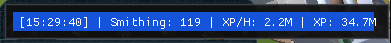

  
  <h3 align="center">Smithy Artisans' Workshop AIO Smither/Smelter</h3>

  

  

<!-- TABLE OF CONTENTS -->

  
Table of Contents

  <ol>
    <li>
      <a href="#quick-start">Quick start</a>
      <ul>
        <li><a href="#prerequisites">Prerequisites</a></li>
      </ul>
    </li>
    <li><a href="#roadmap">Roadmap</a></li>
  </ol>

## ⚡️ Quick start

Download [Smithy](https://github.com/higgins-dotcom/lua-scripts/raw/main/Smithy/Smithy.zip) and extract into the Lua_Scripts folder 
Open Smithy.lua and add your tasks to the TASKS section 
Update any other settings 
Start Script

## ⚙️ Prerequisites

Start in Artisans' Workshop

## 📝 Roadmap

- [ ] None

(<a href="#readme-top">back to top</a>)
