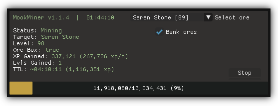

# MookMiner v1.1.4
[](https://opensource.org/license/gpl-2-0)





An AIO mining script with auto navigation, optional banking (+ ore box/gem bag/runecrating pouch), and manual or level-based ore switching.

Currently supports:
- All core rocks including Primal
- Gem rocks:
  - Common
  - Uncommon
  - Precious
  - Prifddinas
- Minerals:
  - Clay
  - Limestone
  - Granite
  - Sandstone
  - Red Sandstone
  - Crystal Sandstone
- Misc:
  - Rune/Pure Essence (currently only supports small-giant pouches, I'll add massive once I figure out how to check if it's empty)

#### Requirements
- [Dead's Lodestones](https://me.deadcod.es/lodestones)
- `data/ores.lua`
    - Note: `api.lua` and `lodestones.lua` must go in the root `Lua_Scripts` directory.
- Unlocked lodestones:
    - Al Kharid (Banking, Gold, Silver, Uncommon - Precious Gems)
    - Varrock (Mithril, Adamantite, Dark Animica, Pure/Rune Ess)
    - Falador (Coal, Luminite, Orichalcite)
    - Edgeville (Runite, Banite)
    - Wilderness (Drakolith, Necrite, Primals if not using Ring of Kinship)
    - Canifis (Phasmatite)
    - Prifddinas (Corrupted, Prif Gems, Crystal sandstone)
    - Anachronia (Light Animica)
    - Bandit Camp (Granite, Sandstone) [Script currently does nothing to check for desert heat mitigation]
    - Oo'glog (Red sandstone)

#### Setup
- Set up inventory (Ore box/gem bag/RC pouches, urns, BotG, GotE, outfit, etc)
- Optional:
  - Edit config (see below)
  - Edit any items in `MINER.ORES` to suit your needs (disable ore box, change locations, etc)
  - Ring of Kinship either equipped or in inventory for faster traversal to Primals
- Start script
- Select ores in the dropdown to switch target
- Click go

#### Config
Edit the following values in `mookMiner.lua` to change config values:
- `MINER.Level_Map` - Add/edit entries to change which ores to mine at certain levels
- `MINER.DefaultBanking`
  - `true`  - uses ore box/gem bag and will bank when full
  - `false` - ignores ore box/gem bag and drops ore when full
- `MINER.DefaultOre`
  - `nil` - uses level-based ore selection
  - `string` - matches string against keys in `MINER.ORES` (i.e. "Banite", "Corrupted", etc), and either mines that ore, or exits if no ore is found with the given key. Valid options are listed in the comment above this setting in `mookMiner.lua`.

#### Known issues
- It's entirely possible to die on the way to the Necrite spot due to the aggressive creatures. I recommend either mining Phasmatite at that level instead, or re-writing the traversal function to avoid these creatures if that's a concern. Not really sure I can do anything to fix this one. [disable auto-retaliate may help]
- The script does not currently check whether the player has the required lodestones unlocked. Will add this in a later version, possibly with auto-unlocking of lodestones which don't have quest reqs (Prif).
- Traversal area checks are a little flaky after the latest ME update. Will investigate this when I have time, but for now it still works with a little jank.
  
#### TO DO
- More teleport checks:
  - Arch journal (digsite)
- Primal ore loop
  - Starts at novite, mines until needs to bank, then switches to next primal ore
- Tweak traversal function to allow it to more reliably exit
- Automatic pickaxe switching
  - From bank initially, eventually buying off GE

#### Changelog
v1.1.4
```
- Added Go/Stop button
- Added Clay, Limestone, Granite, Sandstone (+ Red/Crystal, with daily limit check)
- Added Pure/Rune Essence & support for runecrafting pouches up to Giant
- Added category selection to prevent cluttering the dropdown
- Switched common gems to Burthorpe mine for faster banking
- Improved banking and dropping
- Improved Burthorpe Mine traversal
- Changed Seren Stone mining method for better reliability if interrupted
```

v1.1.3
```
- Added primal ores & ore box
- Sorted dropdown in level order instead of alphabetically
- Moved config options into mookMiner.lua
- Added banking config option
- Added default ore config option
- Fixed random crash when fetching mining level
- Added checks for inventory/equipment interfaces being open (will open inventory if it's not open before using items from it, i.e. ore box)
- Made traversal function exit a bit more reliably. Still more work to do here.
```

v1.1.2
```
- Fixed Light Animica (apparently I forgot to add the rock IDs)
```

v1.1.1
```
- Replaced progress bar with a custom one because I hated the built-in ones
- Moved area check to MINER:Mine() to prevent crashing at Al Kharid bank
- Commented out Seren Stone in the default level map for people without Prif - uncomment it to re-enable
```

v1.1.0
```
- Added GUI-based ore selection and custom display for status, xp/h, gains, etc
- Added gold & silver ore
- Reduced check area in main loop
- Improved reliability of ore switching
- Big ol' refactor
```

See CHANGELOG.md for older versions